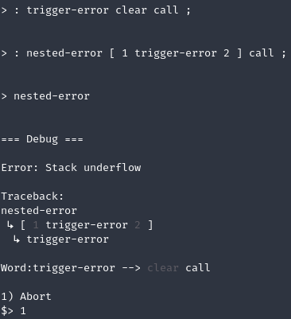
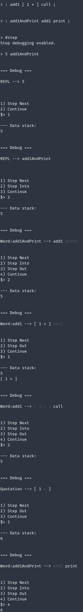

An interpreter for a stack-based, concatenative language inspired by [Factor](http://factorcode.org). Factor is a Forth-like language.

## Introduction

Stack-based languages operate on a stack of values. Executing a normal value will push it onto the top of the stack. The language also provides various operations for manipulating the values on the stack.

Operations pop their parameters from the stack and push their return values onto the stack. For example, the `+` operation will pop the top two values from the stack, add them, and then push the result:

```
> 2 6 +

--- Data stack:
8
```

This is referred to as postfix or Reverse Polish notation.

The concatenative nature of the language means that concatenating two programs results in the composition of those two programs.

For example, if you had two operations, one that multiplied a value by 2 (`2 *`) and one that added 3 (`3 +`), you could compose those two operations by simply concatenating them together (`2 * 3 +`).

Operations or functions in Forth-like languages are often called "words" and the list of defined words is the "vocabulary". You add a word to the vocabulary with the following syntax:

```
: <name> <..body..> ;
```

For example, the following defines a word named `square` which duplicates the value on the top of the stack and then multiplies them together:

```
: square dup * ;
```

It can then be executed:

```
> 5 square .
25
```

(Note: the `.` operation simply pops the top value from the stack and displays it)

In addition to primitive values such as integers (`1`), floats (`2.5`), and strings (`"test"`), the language also supports arrays (`{ 1 2 3 }`) and quotations (`[ 2 * 3 + ]`) which are similar to lambdas.

## Examples

```
: square dup * ;
: even? % 2 0 = ;

{ 1 2 3 4 5 } [ even? ] filter [ square ] map .

=> { 4 16 }
```

```
: fib
    dup 2 < [
        [ 1 - fib ] [ 2 - fib ] bi +
    ] unless ;

15 fib .

=> 610
```

See [StackLang.Interpreter.Tests/Tests.fs](https://github.com/mattherman/stack-lang/blob/main/StackLang.Interpreter.Tests/Tests.fs) for more examples.

## Debugging

The REPL includes a debugger. It is attached by default and set to begin debugging on error.

When an error occurs execution will be paused and diagnostic information printed to the console. This includes the error message, the current stack, a stack trace, and the execution context that triggered the error.



Note: `trigger-error` in `[ 1 trigger-error 2]` and `call` in `clear call` are highlighted in the console when actually running the debugger in order to indicate what token was being executed in the trace.

Currently, the only option is to abort execution. The interpreter will be returned to the state before the last input to the REPL.

You can enable step debugging with the `#step` command. This will allow you to step through execution in various ways.


